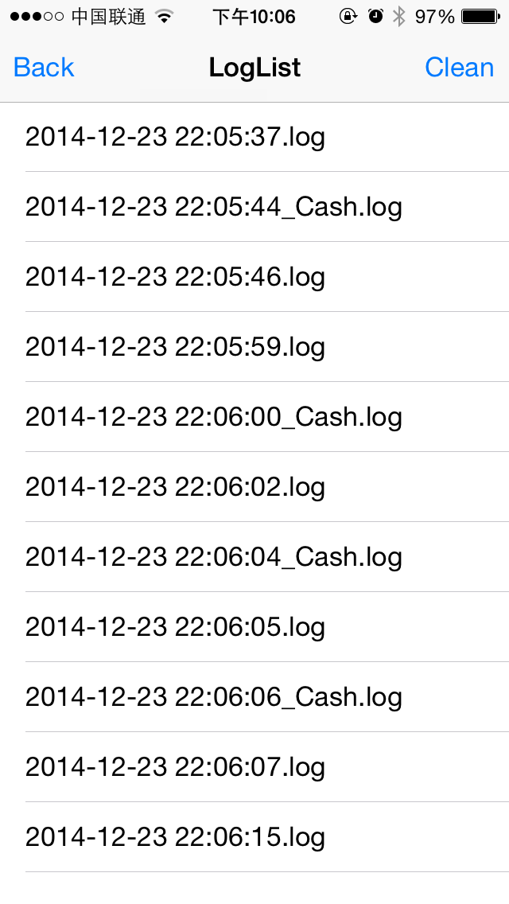
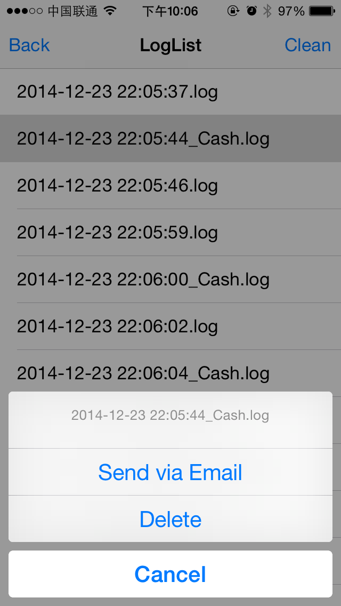
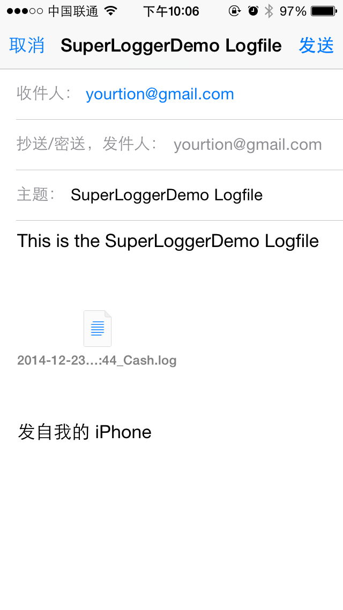

SuperLogger
===========
[](https://github.com/Carthage/Carthage)
[](http://cocoapods.org/pods/SuperLogger)
[](http://cocoapods.org/pods/SuperLogger)
[](http://cocoapods.org/pods/SuperLogger)
[](https://travis-ci.org/yourtion/SuperLogger)

Save NSLog() to file and send email to developer

## Installation

The preferred way of installation is via CocoaPods. Just add

```ruby
pod 'SuperLogger'
```

and run pod install. It will install the most recent version of SuperLogger.

## How to use

Import the framework header on AppDelegate.m:

```objective-c
#import "SuperLogger.h"
```

Init and set email info:

```objective-c
SuperLogger *logger = [SuperLogger sharedInstance];
// Start NSLogToDocument
[logger redirectNSLogToDocumentFolder];
// Set Email info
logger.mailTitle = @"SuperLoggerDemo Logfile";
logger.mailContect = @"This is the SuperLoggerDemo Logfile";
logger.mailRecipients = @[@"yourtion@gmail.com"];
```

That's it! Have fun with SuperLogger!

Show the Loglist by presentViewController "[[SuperLogger sharedInstance] getListView]" 

```objective-c
[self presentViewController:[[SuperLogger sharedInstance] getListView] animated:YES completion:nil];
```

## ScreenShot






